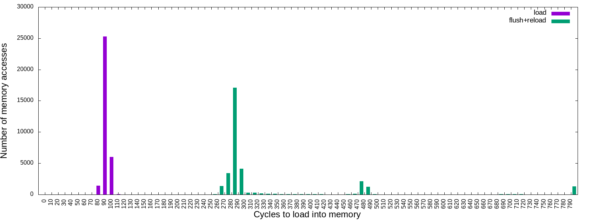
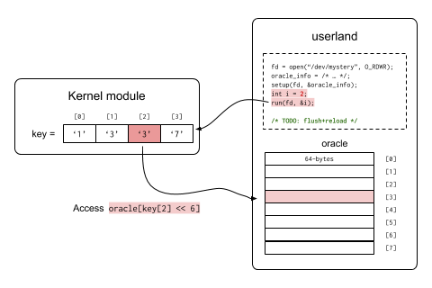

Lab Assignment: Flush+Reload Side-Channel Attacks
=================================================

In this assignment, you will play with a famous mirco-architectural
side-channel attack: Flush+Reload attack. This assignment has two
sub-tasks. 

The first task is a simple, preliminary attack for launching a
realistic flush+reload side-channel attacks (which will be done in the
second task). The goal of the first task is to observe the time
difference between cache hits and misses.

In the second task, you will be launching flush+reload side-channel
attacks. In particular, your goal is to infer the secret value placed
in the kernel module. This inference is a side-channel attack, since
your attack works by running a user program and the user program is
not supposed to access any data placed in the kernel.


## Environment Setup

First, you will need to install
[vagrant](https://www.vagrantup.com/docs/installation/) on your own
machine (check vagrant document to install it on your OS).

Once you installed `vagrant`, then run the following commands. Note
that this assignment will be using `ubuntu/bionic64`, a different VM
that you have used for the assignment 1 and 2.

```sh
# Fetch Ubuntu 18.04 VM from the server.
$ vagrant box add ubuntu/bionic64

# Prepare vagrant settings for the VM in the current working directory.
$ vagrant init ubuntu/bionic64

# Boot-up the VM
$ vagrant up

# ssh into the VM
$ vagrant ssh
```

Now you are in the vm, and run the following commands within vm to
initialize the environment.

```sh
./setup.sh

```

## Task-1. Capturing Time Differences in Cache Access

* (Expected) Results



Related files are located in `task1` directory. You should fill in `TODO`s in
`task1/flush-relod.c` to print output like this:

```
$ cd task1
$ make
$ ./flush-reload
cycles,load,flush+reload
0,0,0
10,0,0
20,0,0
30,0,0
40,0,0
50,0,0
60,0,0
70,0,0
80,1431,0
90,25292,0
100,5995,0
110,36,0
120,2,0
130,0,0
140,1,0
...
```

Your goal is to reproduce the result seen above (or somewhat similarly) by
filling in `TODO`s in `task1/flush-reload.c`. For your convenience, we provide
utility functions such as `clflush()` and `measure()` in `utils.h`. If you
want to plot your results into an image, use `make plot-flush-reload` command.
This command assumes your measurement results are printed to `stdout`.

```
$ make plot-flush-reload
[+] Run FLUSH+RELOAD...
[*] Results recorded to flush-reload.csv
[+] Plot the result...
```

## Task-2. Flush+Reload Side-Channel Attacks

Now you are ready to do real-fun stuff! In this task, you are going to
leak secrete value placed in the kernel using flush+reload
attacks. Related files are located in `task2` directory and the main
file you have to modify is `task2/user/userland.c`.  Here is the simple
attack flow.



First you will install the kernel module

```
[vm]$ sudo insmod mystery.ko
```

Now what does this kernel module do? This kernel module contains a
secret mapping from [0, 15) to characters. For example:

| index | secret(index) |
|-------|---------------|
| 0     | '1'           |
| 1     | '3'           |
| 2     | '3'           |
| 3     | '7'           |

If you invoke the `run` function with an argument `index`, the kernel
module will silently access the _oracle_ in the user's address space,
and the accessed address is determined depending on the secret value.
More specifically, if you invoke `run` function with index `index`
the kernel module performs the following operations. (Note that this
is written as pseudocode)

```python
# Initial values
#   - oracle: base address of the oracle
#   - secret: kenrel secret mapper (ind -> secret value)
#
# Input
#   - index: passed by invoking `run(index)`
#
def do_run(index):
    if ind < 16:
        access(oracle[secret(index) << 6])
```

Have you noticed how to leak the key using the flush+reload attack?
For your convenience, you may use functions in `task2/utility.h` and
`run()` defined in `task2/oracle.h`.  Your goal is to fill in `TODO`s
in `userland.c` to leak the secret. We embedded 16 byte secret in the
kernel module, i.e. `secret(0)` to `secret(15)`. However for this
assignment you should leak only 4 bytes (`secret(0)` to `secret(3)`).
You should submit both (1) the kernel secrets and (2) the source code
(doesn't have to leak all bytes at once, but you should include
explanations if it requires some manual steps) you used. We provide
you with a skeleton code `task2/userland.c` with utility functions.
You can compile the `userland` program by `make`. Have fun!

Known issues: kernel version mismatch
